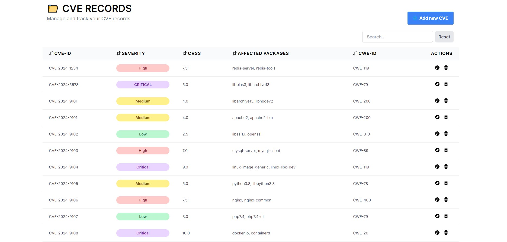

# CVE Database Application 📁

📚 This is a responsive web-based CVE database application that allows users to view and manage CVE records. The application provides a user-friendly interface for viewing detailed information about CVE entries. Users can also add, edit, and delete CVE records as needed.

## Features

✨ The CVE Database Application includes the following features:

- View CVE records: Users can browse and search for CVE records.
  

- Detailed information: Users can view detailed information about each CVE entry.
  

- Add and Edit CVE records: Users can add new CVE records to the database and update existing CVE records.
  

- Delete CVE records: Users can remove unwanted CVE records from the database.
  

## Installation

⚙️ To run the CVE Database Application locally, follow these steps:

1. Clone the repository: `git clone https://github.com/Ciriously/REACT-CRUD-APP`
2. Install the dependencies: `npm install` or `yarn install`
3. Configure the backend and database settings.
4. Start the application: `npm start` or `yarn start`
5. Open your browser and visit: `http://localhost:3000`

## Technologies Used

🚀 The CVE Database Application is built using the following technologies:

- React for the frontend using HTML, CSS, and JavaScript.
- Tailwind CSS for responsive and modern UI design.

## Deployment

🚀 The CVE Database Application is deployed on Vercel. You can access it [here](https://crudapp-indol.vercel.app/).

## Contributing

🤝 Contributions are welcome! If you have any ideas, suggestions, or bug reports, please open an issue or submit a pull request.

## License

📝 This project is licensed under the [MIT License](LICENSE).
